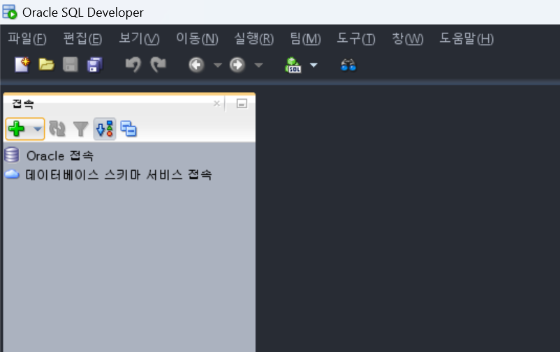
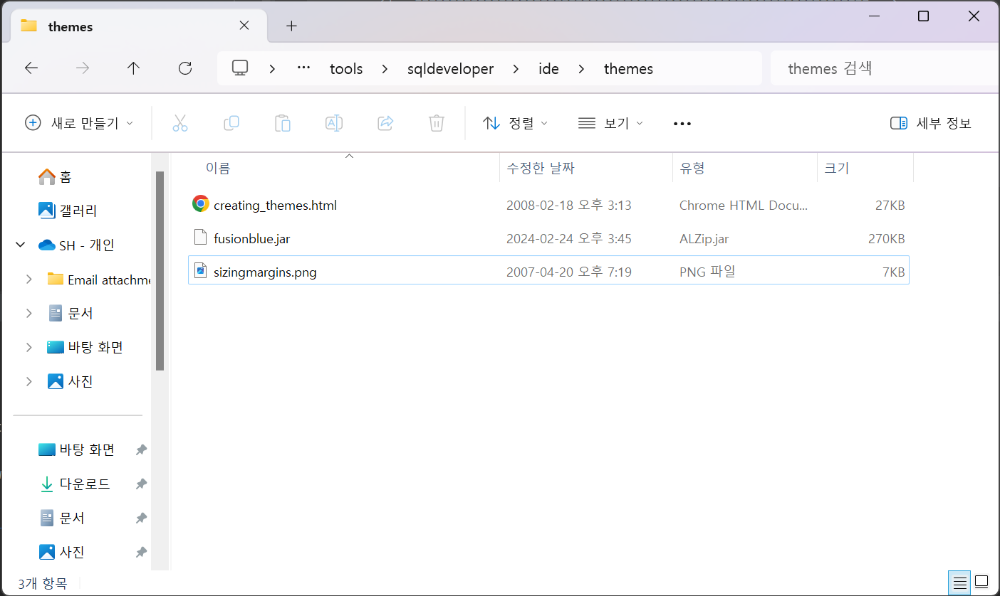
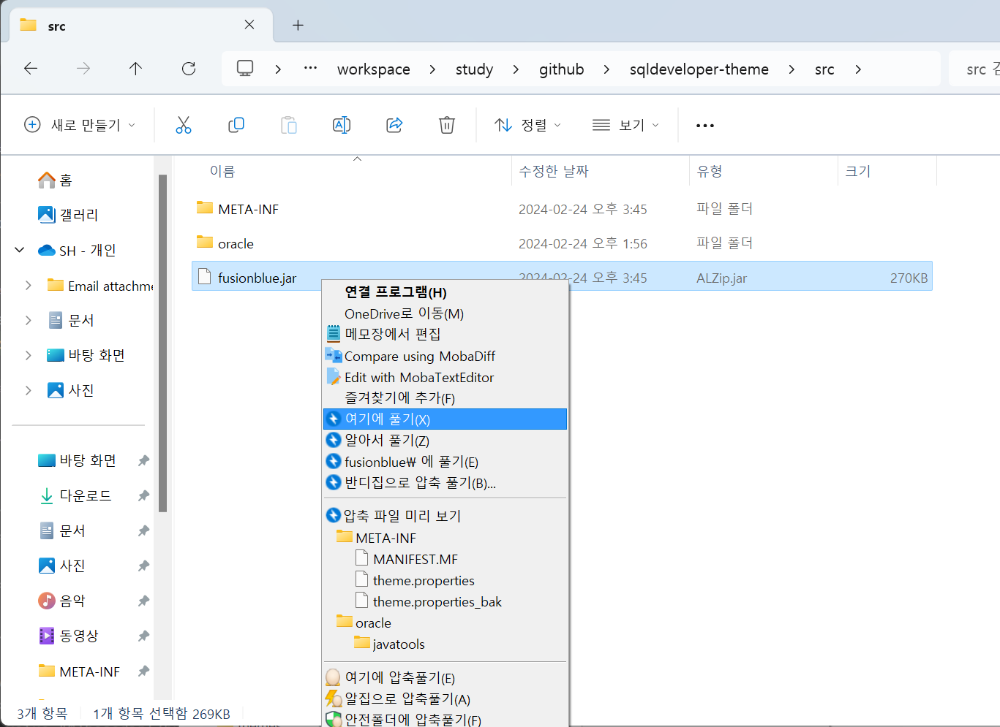

# sqldeveloper-theme

### TL;DR
- fusionblue.jar 파일이 있는 디렉토리 찾기(${SQLDEVELOPER_HOME}/ide/themes)
- fusionblue.jar 파일 압축해제(ex: C:/workspace/github/sqldeveloper-theme/src)
- theme.properties 파일의 색상코드들 편집하여 저장(META-INF/theme.properties)
- build.xml 파일의 deploy-jar-path 경로 값 변경
- fusionblue.jar 빌드하여 배포

### SQL Developer 결과물


### 1. fusionblue.jar 파일 복사해오기
- ${SQLDEVELOPER_HOME}/ide/themes/fusionblue.jar  


### 2. fusionblue.jar 파일 압축해제 


### 3. META-INF/theme.properties 파일 색상코드 편집
```
# theme name: 테마의 이름을 지정합니다.정의
name=Fusion Blue (Default)
# image path: 테마에 사용되는 이미지 파일 기본 경로
imagebase=/oracle/javatools/themes/fusionblue

# 주요 컨트롤 색상
colors.secondary3=#ABB2BF
# 체크박스 체크 색상 정의
colors.toggleButtonCheckColor=#61AFEF

# 메뉴바 색상
menubar.normal.label.foreground=#ABB2BF
menubar.normal.label.font-weight=normal
menubar.mouseover.label.foreground=#010101
menubar.mouseover.label.font-weight=normal
menubar.selected.bg.type=stretch
menubar.selected.bg.image=menu_selected.png
menubar.selected.bg.edge=left
menubar.mouseover.bg.type=stretch
menubar.mouseover.bg.image=menu_over.png
menubar.mouseover.bg.edge=left
menubar.inset=4 5 4 5
menubar.mouseover.border=#282C34
menubar.mouseover.corner=#282C34
menubar.selected.border=#282C34
menubar.selected.corner=#282C34
...
```

### 4. build.xml 파일의 deploy-jar-path 경로 값 변경하기(value="C:\tools\sqldeveloper\ide\themes")
```
<?xml version="1.0"?>
<project name="sqldeveloper-theme" basedir="." default="jar">
	<!-- ================================================================= -->
	<!-- P R O P E R T I E S                                               -->
	<!-- ================================================================= -->
	<!-- program name -->
	<property name="name" value="sqldeveloper-theme" />
	<!-- project version -->
	<property name="version" value="0.0.1" />
	<!-- the jar directory -->
	<property name="dest.jar" value="${basedir}/build/jar" />
	<!-- deploy dir: 경로 지정하기 -->
	<property name="deploy-jar-path" value="C:\tools\sqldeveloper\ide\themes" />
...
```
### 5. 빌드/배포하기 (ex: ant 사용)
```
C:\workspace\github\sqldeveloper-theme>ant deploy
Buildfile: C:\workspace\github\sqldeveloper-theme\build.xml

init:

build:
    [mkdir] Created dir: C:\workspace\github\sqldeveloper-theme\build\jar
      [jar] Building jar: C:\workspace\github\sqldeveloper-theme\build\jar\fusionblue.jar

check:

backup:
     [copy] Copying 1 file to C:\tools\sqldeveloper\ide\themes

deploy:

BUILD SUCCESSFUL
Total time: 0 seconds
```