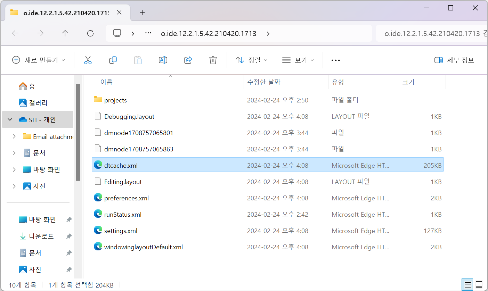
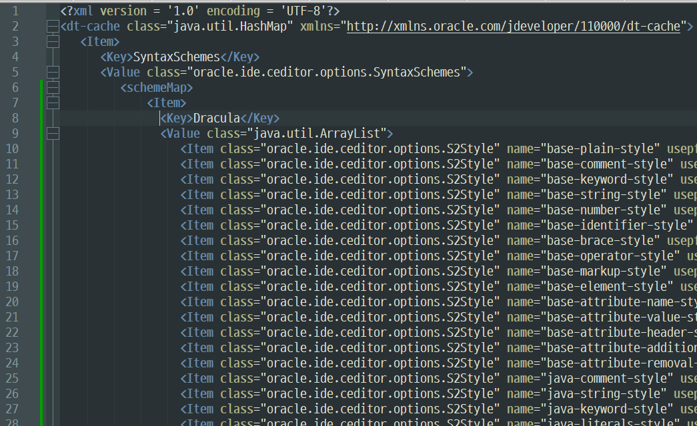
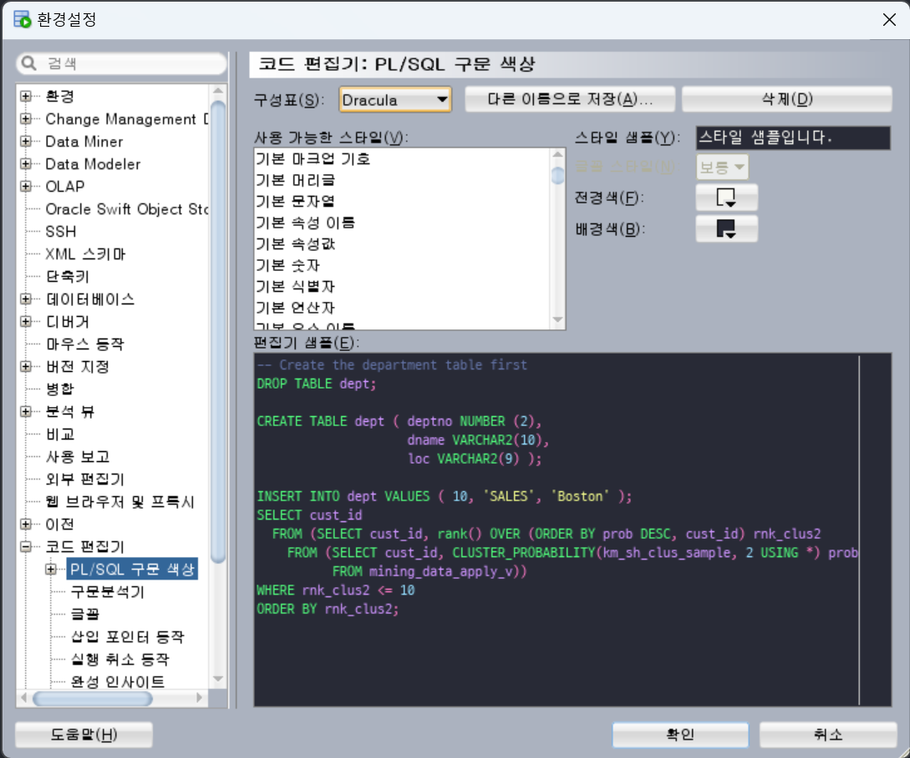

# Oracle SQL Developer 코드 에디터 창 Dracula 테마 적용
### TL;DR
- dtcache 파일 열기
  + Windows 경로: C:\Users\<user-name>\AppData\Roaming\SQL Developer\systemn.n.n.n.n.n\o.ide.n.n.n.n.n.n.n
  + Linux / Mac OS X 경로: ~/.sqldeveloper/systemn.n.n.n.n.n/o.ide.n.n.n.n.n.n.n
- dt-cache.Item.Value.schemeMap에 Item(dtcache_add_snippet.xml) 추가하기
- SQL Developer 실행하여 변경: 도구 -> 환경설정 -> 코드 편집기 -> PL/SQL 구문 색상 -> 구성표에서 Draclua 선택

### 1. SQL Developer를 한번이라도 실행하게 되면 아래 경로에 dtcache.xml 파일이 존재
- [Location of User-Related Information](https://docs.oracle.com/en/database/oracle/sql-developer/19.1/rptig/installing-sql-developer.html#GUID-16F0A7C3-6EC1-4176-9B15-FE4AA8D70D5F)
- 경로 예시
  + Windows: C:\Users\<user-name>\AppData\Roaming\SQL Developer\systemn.n.n.n.n.n\o.ide.n.n.n.n.n.n.n
  + Linux / Mac OS X 경로: ~/.sqldeveloper/systemn.n.n.n.n.n/o.ide.n.n.n.n.n.n.n  


### 2. dtcache.xml 파일에 dtcache_add_snippet.xml XML 구문 추가하기 - [예시파일](./dtcache_example.xml)
```
<?xml version = '1.0' encoding = 'UTF-8'?>
<dt-cache class="java.util.HashMap" xmlns="http://xmlns.oracle.com/jdeveloper/110000/dt-cache">
   <Item>
      <Key>SyntaxSchemes</Key>
      <Value class="oracle.ide.ceditor.options.SyntaxSchemes">
         <schemeMap>
             # 여기에 추가하기
             
             <Item>
               <Key>Classic</Key>
               <Value class="java.util.ArrayList">
                 <Item class="oracle.ide.ceditor.options.S2Style" name="base-plain-style" usepfg="false" frgb="-103" usepbg="false" brgb="-16777063" usepfont="false" font="0"/>
                 <Item class="oracle.ide.ceditor.options.S2Style" name="base-comment-style" usepfg="false" frgb="-6684673" usepbg="true" brgb="-16777063" usepfont="true" font="0"/>
                 <Item class="oracle.ide.ceditor.options.S2Style" name="base-keyword-style" usepfg="false" frgb="-2039584" usepbg="true" brgb="-16777063" usepfont="false" font="1"/>
                 <Item class="oracle.ide.ceditor.options.S2Style" name="base-string-style" usepfg="false" frgb="-6684775" usepbg="true" brgb="-16777063" usepfont="true" font="0"/>
...
```


### 3. SQL Developer 실행하여 변경
- 상단 메뉴에서 도구 or Tools 선택
- 환경설정 or Preferences 선택
- 코드 편집기 or Code Editor 선택
- PL/SQL 구문 색상 or PL/SQL Syntax Colors 선택
- 구성표 or Scheme 선택하여 Draclua 선택  
